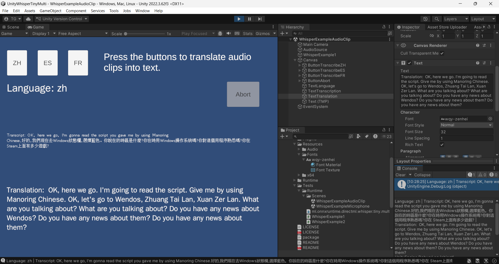
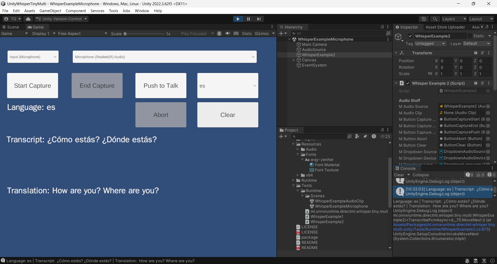

# Whisper Tiny Multi (OnnxRuntime/DirectML) for Unity

OpenAI Whisper is an automatic speech recognition (ASR) model trained on diverse multilingual audio; it transcribes speech to text, can auto-detect language, and can translate many languages to English. This package bundles the tiny multilingual variant for lightweight, offline transcription/translation on Windows.

ONNX Runtime is a high-performance inference engine for ONNX models; this package uses it to run the Whisper model efficiently on Windows.

DirectML is a Windows machine-learning acceleration API that runs on DirectX 12-capable GPUs and can fall back to CPU when needed.

This is a Windows x64 package that embeds the OpenAI Whisper tiny multilingual model inside a single native DLL, accelerated by ONNX Runtime with DirectML. Supports the Unity Editor and Windows Standalone 64-bit builds. Setup is turnkey and fully offline: no downloads, just unpack the DLL, open the example scenes directly from the package, and choose your audio source (clip or microphone) for transcription or dictation.

## Platforms
- **Supported:** Windows 64-bit — Unity Editor and Windows Standalone player builds.
- **Not supported:** macOS, Linux, mobile, consoles.

## What’s inside
- Native plugin built on **ONNX Runtime + DirectML**; the full Whisper tiny multilingual model is contained in one DLL (no external model downloads, works fully offline).
- Editor utilities to unpack binaries and example content.
- Example scenes showing:
	- Audio clip transcription (from StreamingAssets).
	- Microphone capture for dictation with push-to-talk or continuous capture.

## Package contents
- **Plugins/Windows/x64**: native DirectML/ONNXRuntime DLL with the embedded Whisper tiny multilingual model (unpacked via menu).
- **Tests/Runtime/Scenes**: example scenes that can be opened directly from the package or copied into your project.
- **StreamingAssets/Audio**: sample clips `WhisperTest_Chinese.wav`, `WhisperTest_French.wav`, `WhisperTest_Spanish.wav` for clip-based transcription/translation (unpacked via menu).
- **Editor scripts**: menu items to unpack DLLs, test audio, and examples.
- **C# samples**: microphone and clip transcription workflows.

## Quick setup
1) **Unpack the DLL:** `Assets → WhisperTinyMulti → Unpack WhisperTinyMulti DLLs` (extracts into a single native DLL in `Plugins/Windows/x64`).
2) **Unpack test audio:** `Assets → WhisperTinyMulti → Unpack WhisperTinyMulti Example Audio` drops the samples `WhisperTest_Chinese.wav`, `WhisperTest_French.wav`, `WhisperTest_Spanish.wav` into `Assets/StreamingAssets/Audio` for the clip-based example.
3) **Open an example scene (no import needed):** open directly from the package (or copy to your project if you prefer) and press Play in the Editor. Everything runs offline; no extra downloads are required.

## Audio sources
- **Audio Clip:** Use one of the included `WhisperTest_Chinese.wav`, `WhisperTest_French.wav`, `WhisperTest_Spanish.wav` clips in StreamingAssets, or point to your own clip. Clips are downmixed and resampled to 16 kHz mono before inference.
- **Microphone (dictation):** Uses Unity `Microphone` API (input). Modes:
	- **Continuous capture:** start/stop buttons, segments sent on silence break or max duration.
	- **Push-to-talk:** hold a button to capture, release to send.

## Example features
- Language detection + transcription from PCM (16 kHz mono floats).
- Translation to English (from detected or user-selected language).
- Rolling transcript buffer with max length guard.
- UI hooks via TextMeshPro; dropdowns to pick audio source/device (input only; loopback not implemented in this sample).

## Notes
- Prefers a DX12-capable GPU/driver for DirectML acceleration; will fall back to CPU if GPU isn’t available.
- Keep Plugins and StreamingAssets in place; the model DLL must remain alongside the plugin binaries.
- Works offline; no model downloads or updates required.
- Works in Editor and Windows Standalone 64-bit builds (x64 only).
- On unsupported platforms, `DetectLanguage`, `Transcribe`, and `Translate` return an empty string.

## Tech stack
- **Model:** OpenAI Whisper (tiny multilingual) converted to ONNX.
- **Runtime:** ONNX Runtime with DirectML execution provider (Windows x64).
- **Unity:** TextMeshPro + UGUI for UI bindings; Unity `Microphone` API for input.

## Licensing
- This package is licensed under the **Unity Asset Store Terms of Service and EULA** (see <https://unity.com/legal/as-terms> and the license overview at <https://support.unity.com/hc/en-us/articles/208601846-Asset-Store-licenses-Extension-Assets-Single-and-Multi-Entity-assets>).
- This asset is intended to be treated as an **Extension Asset**; per Unity’s terms, you must purchase one seat per user who has access to the raw asset files.
- Third-party components:
	- **DirectML** (MIT, <https://github.com/microsoft/DirectML/blob/master/LICENSE>)
	- **ONNX Runtime** (MIT, <https://github.com/microsoft/onnxruntime/blob/main/LICENSE>)
	- **OpenAI Whisper** (MIT, <https://github.com/openai/whisper/blob/main/LICENSE>)
	- **WenQuanYi Font** - GNU General Public License (<https://en.wikipedia.org/wiki/WenQuanYi>)

## Troubleshooting
- Missing TMPro types: ensure your asmdef references `Unity.TextMeshPro` (and `UnityEngine.UI` for UGUI).
- DLL load issues: confirm x64 Editor, DirectML-capable GPU/driver, and that DLLs were unpacked to `Plugins/Windows/x64`.
- No audio input devices: check OS privacy settings and that a microphone exists.

## Minimal API
```csharp
var whisperTinyMulti = new DllWhisperTinyMulti();    // create the client (loads the native DLL/model)

// pcm: float[] mono, 16 kHz samples
var language = whisperTinyMulti.DetectLanguage(pcm);                                         // detect language (e.g. "en", "fr")
var transcript = whisperTinyMulti.Transcribe(pcm, language);      // transcribe in source language
var translation = whisperTinyMulti.Translate(pcm, language);      // translate to English

// Auto language detection:
// - pass an empty string (or null) to let the DLL detect the language internally.
// - if your UI uses the literal string "auto", convert it to "" before calling the API.
var transcriptAuto = whisperTinyMulti.Transcribe(pcm, language: "");
var translationAuto = whisperTinyMulti.Translate(pcm, language: "");
```

That’s it: create the client, pass PCM (mono, 16 kHz floats), detect language, and decode.

## API
- `DllWhisperTinyMulti()`
	- Input: none; creates the client and loads the native DLL/model (may throw if binaries are missing).
	- Output: client instance; inference methods will return empty strings on unsupported platforms.
- `SetProgress(DllWhisperTinyMulti.ProgressCallback callback)` (static)
	- Input: callback invoked from the native decoding loop with `(stage, current, total, partialText)`.
	- Notes:
		- `stage`: 0=preprocess, 1=encoder, 2=decoder, 3=done.
		- `current/total`: progress counters for the current stage (treat as best-effort).
		- `partialText`: partial transcript while decoding.
		- Call `DllWhisperTinyMulti.ClearProgress()` (static) to unsubscribe.
- `DetectLanguage(float[] pcmMono16k)`
	- Input: mono 16 kHz PCM samples (`float[]`), values typically in [-1, 1].
	- Output: language code string (for example, `"en"`); empty string on unsupported platforms or load failure.
- `Transcribe(float[] pcmMono16k, string language)`
- `Translate(float[] pcmMono16k, string language)`
	- Input: mono 16 kHz PCM samples (`float[]`), values typically in [-1, 1].
	- Input: `language` (e.g., `"en"`, `"fr"`). Pass `""` (or `null`) for auto-detect.
	- Output: transcript text in the requested task.
	- Output: transcript/translation string; empty string on unsupported platforms or load failure.

## Progress callback
You can receive progress updates (and partial text) during decoding:

```csharp
DllWhisperTinyMulti.SetProgress((stage, current, total, partialText) =>
{
    // stage: 0=preprocess, 1=encoder, 2=decoder, 3=done
    // current/total: per-stage counters
    // partialText: partial transcript while decoding
    UnityEngine.Debug.Log($"stage={stage} {current}/{total} partial={partialText}");
});

// ... run Transcribe/Translate calls ...

DllWhisperTinyMulti.ClearProgress();
```

### Converting progress to a percentage
The callback reports **per-call, per-stage** progress. A single `Transcribe(...)` or `Translate(...)` call runs through these stages:
`preprocess -> encoder -> decoder -> done`.

There is no built-in “total % of your whole app pipeline” because you might call `DetectLanguage`, `Transcribe`, and `Translate` separately.

#### A simple, practical mapping (single call)
If you just want a 0–100% value for one `Transcribe` *or* one `Translate` call, a reasonable approximation is:

```csharp
static float GetTranscriptionProgressPercent(int stage, int current, int total)
	=> 100f * GetStageWeightedProgressNormalized(stage, current, total);

static float GetTranslationProgressPercent(int stage, int current, int total)
	=> 100f * GetStageWeightedProgressNormalized(stage, current, total);

static float GetStageWeightedProgressNormalized(int stage, int current, int total)
{
	float stageNormalized = (total > 0) ? UnityEngine.Mathf.Clamp01((float)current / total) : 0f;

	// Weights: preprocess 10%, encoder 25%, decoder 65%.
	// (Decoder is usually where most time is.)
	return stage switch
	{
		0 => 0.00f + 0.10f * stageNormalized,
		1 => 0.10f + 0.25f * stageNormalized,
		2 => 0.35f + 0.65f * stageNormalized,
		3 => 1.00f,
		_ => 0.00f,
	};
}
```

#### Mapping a “transcribe + translate” run
If you do both (two separate native calls), treat them as two halves:

```csharp
// Call this while transcribing
var pct = 0.50f * GetTranscriptionProgressPercent(stage, current, total);

// Call this while translating
var pct = 50f + 0.50f * GetTranslationProgressPercent(stage, current, total);
```

Notes:
- `DetectLanguage(...)` does not currently report progress; if you include it in your UI, you can show an initial “Detecting…” step or reserve a small fixed percent (e.g., 0–5%).
- `partialText` is meaningful mainly during `decoder` stage.

## Getting PCM data

### From an AudioClip
```csharp
var clip = /* your AudioClip */;                              // source clip
var buffer = new float[clip.samples * clip.channels];         // allocate interleaved buffer
clip.GetData(buffer, 0);                                      // read samples from clip

// Downmix to mono and resample to 16 kHz if needed
float[] pcmMono16k = DownmixAndResample(buffer, clip.channels, clip.frequency, targetRate: 16000);
```

### From Microphone (Unity `Microphone` API)
```csharp
string device = Microphone.devices.FirstOrDefault();          // pick a mic
int sampleRate = 16000;                                       // request 16 kHz
var micClip = Microphone.Start(device, loop: true, lengthSec: 20, frequency: sampleRate);

// Periodically read new samples, append to a List<float>, then send segments to Whisper
micClip.GetData(tempBuffer, offsetSamples);                   // grab the newest chunk
float[] pcmMono16k = tempBuffer;                              // already mono 16 kHz when requested
```

Guidelines:
- Aim for mono 16 kHz floats. Downmix if the clip is stereo, and resample if its rate differs from 16 kHz.
- For mic input, request 16000 Hz in `Microphone.Start` to avoid resampling; otherwise resample to 16 kHz before calling the API.

## Examples

* WhisperExampleAudioClip: Transcribe and translate an audio clip.



* WhisperExampleMicrophone: Transcribe and translate microphone audio.


